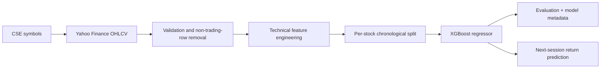

# CSE Stock Analyzer

A reproducible machine-learning research project for analyzing Colombo Stock Exchange (CSE) securities and estimating their **next trading session return** from daily price, volume, momentum, and trend signals.

> **Project status:** research/portfolio project — not a live trading system and not financial advice.

## Why this project?

Public tooling and consistently available market data are more limited for Sri Lankan equities than for larger exchanges. This project demonstrates an end-to-end workflow tailored to CSE symbols:

1. Normalize CSE ticker symbols.
2. Download daily OHLCV history from Yahoo Finance.
3. Remove non-trading/forward-filled observations.
4. Generate scale-independent technical features.
5. Train one cross-sectional XGBoost regression model across many companies.
6. Evaluate it chronologically and predict the next-session percentage return.

The model is **cross-sectional**: it does not use a company ID. It learns patterns shared across securities, which allows it to process a CSE ticker outside the training universe when sufficient history is available.

## Highlights

- 54-symbol, sector-diverse CSE training universe
- Shared feature pipeline for training and inference
- Per-security chronological train/test split to reduce future leakage
- Filtering around implausibly large split/scrip-related price jumps
- MAE, MSE, R², directional accuracy, and zero-return baseline
- Model metadata saved beside each trained artifact
- Fetch, train, and predict CLI
- Offline unit tests—CI does not depend on Yahoo Finance availability

## Architecture



## Model methodology

### Target

The continuous target is the next observed trading session's close-to-close return:

```text
Target_Return(t) = Close(t + 1) / Close(t) - 1
```

This is a **regression** task, not a price-level forecast or classifier. `UP`/`DOWN` is derived from the sign of the predicted return for presentation.

### Features

| Group | Features |
|---|---|
| Intraday price position | `Open_Pct`, `High_Pct`, `Low_Pct` |
| Volume | `Rel_Volume` (relative to a rolling 20-session mean) |
| Momentum | `RSI_3`, `Return_Lag1`, `Return_Lag2` |
| Trend | `SMA_3_Pct`, `EMA_3_Pct` |
| MACD | `MACD_Pct`, `MACD_Hist_Pct` |

Price-derived indicators are normalized by closing price, and no asset identifier is included. See [the methodology](docs/methodology.md) for preprocessing and validation details.

## Repository structure

```text
.
├── src/cse_stock_analyzer/   # installable application package
├── tests/                    # offline tests and synthetic fixtures
├── data/raw/                 # downloaded OHLCV CSVs (gitignored, see below)
├── models/                   # trained model + metadata (generated, ignored)
├── reports/                  # experiment reports and charts
├── docs/                     # methodology and limitations
├── .github/workflows/        # CI: ruff + pytest on every push
├── pyproject.toml            # package, dependencies, and tool configuration
├── LICENSE                   # MIT
└── README.md
```

## Getting started

### Requirements

- Python 3.10 or newer
- Internet access only when downloading current market data

### Installation

```bash
git clone https://github.com/YOUR_USERNAME/cse-stock-analyzer.git
cd cse-stock-analyzer
python -m venv .venv
```

Activate the environment:

```bash
# Windows PowerShell
.venv\Scripts\Activate.ps1

# macOS/Linux
source .venv/bin/activate
```

Install the project:

```bash
pip install -e .

# Include test/lint tools when developing
pip install -e ".[dev]"
```

## Usage

All commands work as either `cse-analyzer ...` or `python -m cse_stock_analyzer ...`.

### 1. Fetch market data

Fetch the complete configured universe:

```bash
cse-analyzer fetch --period 5y
```

Fetch selected securities:

```bash
cse-analyzer fetch JKH.N0000 HNB.N0000 COMB.N0000 --period 5y
```

Short symbols such as `JKH` are normalized to `JKH.N0000`. Existing files are retained unless `--force` is supplied.

### 2. Train and evaluate

Train on locally available data in `data/raw/` (CSVs are not committed to
the repository — see [dataset](#dataset) below):

```bash
cse-analyzer train
```

For reproducible historical experiments, specify an inclusive data cutoff:

```bash
cse-analyzer train --train-end 2025-12-31
```

The default cutoff is 2026-01-31 because Yahoo's CSE feed forward-fills ghost
rows after that date (see [data considerations](#data-considerations)); pass
`--train-end none` to disable it once the feed is live again.

Outputs:

- `models/cse_next_day_regressor.json`
- `models/cse_next_day_regressor.metadata.json`

The metadata contains feature names, included assets, row counts, model parameters, timestamp, cutoff, and evaluation results. Do not copy sample metrics into a portfolio claim—run the command and report the generated results.

### 3. Predict

Use locally downloaded data where available, otherwise fetch recent history:

```bash
cse-analyzer predict JKH.N0000 HNB.N0000
```

Example output shape:

```json
[
  {
    "symbol": "JKH.N0000",
    "observation_date": "2025-12-31",
    "predicted_next_day_return": 0.0021,
    "predicted_next_day_percent": 0.21,
    "direction": "UP"
  }
]
```

This example illustrates the schema only; it is not a current forecast.

### Dataset

Price history is **not included** in the repository — CSVs are ignored by
Git (see `.gitignore`). Download the 54-symbol universe before your first
training run:

```bash
cse-analyzer fetch --period 5y
```

`SOFT.N0000` has no Yahoo Finance history, so in practice this yields ~53
csv files (2021-08 onward, ~4 MB). Yahoo's CSE coverage is uneven — some
symbols may be missing or short; the fetcher skips and reports them rather
than failing. See [data/README.md](data/README.md) for dataset properties
and attribution.

## Testing and code quality

```bash
pytest
ruff check .
```

Tests use deterministic synthetic price series and therefore work without network access.

## Data considerations

Yahoo Finance CSE symbols generally follow this conversion:

```text
JKH.N0000  ->  JKH-N0000.CM
```

Coverage can be patchy. A successful HTTP response does not guarantee complete, current, or corporate-action-adjusted data. The fetcher deliberately uses unadjusted prices (`auto_adjust=False`) and the training pipeline removes neighborhoods around daily returns greater than 40%, which are treated as probable split/scrip artifacts.

Read [Data and limitations](docs/data-and-limitations.md) before interpreting results.

## Limitations and responsible use

- Technical indicators carry weak and non-stationary predictive signals.
- Results can vary materially by cutoff, universe, corporate actions, and data quality.
- The current pipeline does not include fundamentals, disclosures, macroeconomics, news, transaction costs, liquidity, slippage, taxes, or portfolio risk constraints.
- A chronological holdout is useful but is not a complete walk-forward backtest.
- Predicted returns are research outputs—not buy, sell, or hold recommendations.
- Historical performance does not guarantee future performance.

## Roadmap

- Walk-forward and rolling-window validation
- ASPI/S&P SL20 market-regime and relative-strength features
- Corporate-action-aware adjusted data source
- Feature-importance and SHAP reports
- Transaction-cost-aware strategy backtesting
- Optional FastAPI service and dashboard after the research pipeline is validated

## Technology

Python, pandas, NumPy, scikit-learn, XGBoost, yfinance, pytest, and Ruff.

## License and attribution

The source code is released under the MIT License (see [LICENSE](LICENSE)). Market data remains subject to the terms of its original provider and exchange; an open-source code license does not grant redistribution rights for third-party data.

## Disclaimer

This repository is provided for educational and research purposes only. It does not constitute financial, investment, legal, or tax advice. Independently verify all data and consult a qualified professional before making investment decisions.
